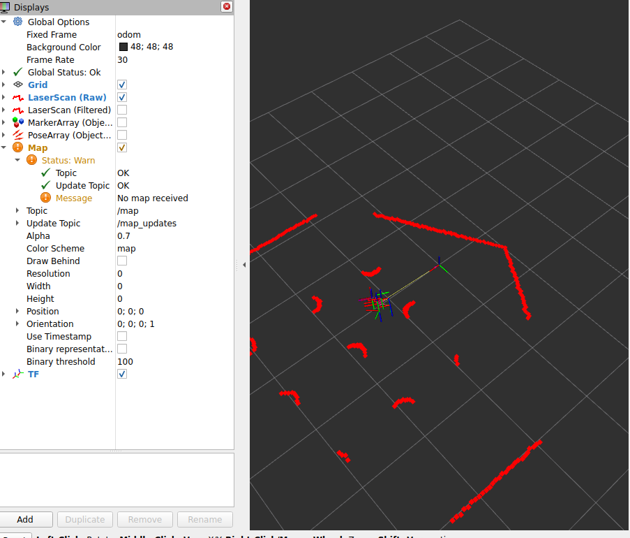

# T2 Teszt Jegyzetek

**Dátum:** 2025-10-29  
**Tesztelő:** Mitrenga Márk

## Teszt konfiguráció

- **Robot model:** TurtleBot3 Waffle
- **Világ:** turtlebot3_world.world
- **Node:** lidar_filter_node
- **Paraméterek:**
  - min_range: 0.1m
  - max_range: 10.0m
  - min_cluster_size: 3
  - cluster_threshold: 0.2

## Megfigyelések

### Inicializáció
- [] Gazebo elindult sikeresen
- [] LIDAR Filter Node inicializálva
- [] RViz megnyílt
- [] Scan vizualizáció látható
- [] Markerek megjelennek

### Mozgás közben
- [] Objektumok detektálása mozgás közben
- [ ] Markerek követik az objektumokat
- [ ] FPS stabil marad
- [ ] Nincs késleltetés

### Teljesítmény
- Átlagos FPS: _____
- Detektált objektumok száma: _____
- CPU használat: _____
- Memory használat: _____

## Problémák / Hibák

Nagyon lassú. A Gazebo feluletén az látszik hogy folyamatosan váltakozik a pause és start. Az Rviz nagyon ocsmány , sokkal több nyíl és koordináta rendszer van mint kéne legyen (1db preferált a turtlebothoz). A map valami warningot is ír.

## Következtetések

Mind 8 CPU maximumon pörgött a teszt közben (és mindig amikor megnyílik a gazebo).
