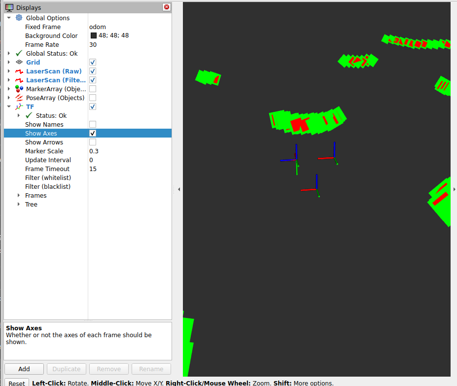

# T2 Teszt Jegyzetek - Optimalizált Verzió (v2)

**Dátum:** 2025-10-29  
**Tesztelő:** Mitrenga Márk  
**Verzió:** 2.0 (Optimalizált)

## Teszt konfiguráció

- **Robot model:** TurtleBot3 Waffle
- **Világ:** turtlebot3_world.world
- **Node:** lidar_filter_node
- **Launch:** optimized_system.launch.py
- **RViz config:** lidar_filter_optimized.rviz
- **Paraméterek:**
  - min_range: 0.1m
  - max_range: 10.0m
  - min_cluster_size: 3
  - cluster_threshold: 0.2

## Optimalizációk

### Javított beállítások:
- ✅ RViz: Csak 3 TF frame (odom, base_link, base_scan)
- ✅ Map display eltávolítva (warning megszűnés)
- ✅ Helyes topic nevek: /filtered_scan, /objects, /object_markers
- ✅ Optimalizált marker megjelenítés

## Megfigyelések

### Inicializáció
- [ ] Gazebo elindult sikeresen
- [ ] LIDAR Filter Node inicializálva
- [ ] RViz megnyílt optimalizált config-gal
- [ ] Scan vizualizáció látható (PIROS)
- [ ] Filtered scan látható (ZÖLD)
- [ ] Markerek megjelennek (CYLINDEREK)

### Mozgás közben
- [ ] Objektumok detektálása mozgás közben
- [ ] Markerek követik az objektumokat
- [ ] FPS stabil marad
- [ ] Nincs késleltetés
- [ ] Csak 3 TF frame látható

### Teljesítmény (v2)
- Átlagos FPS: _____
- Detektált objektumok száma: _____
- CPU használat: _____% (előző: 100%)
- Memory használat: _____
- Gazebo RTF (Real Time Factor): _____

### RViz megjelenés
- [ ] Tiszta, nem "ocsmány"
- [ ] Kevesebb koordináta rendszer
- [ ] Nincs Map warning
- [ ] Markerek jól láthatók

## Rosbag ellenőrzés (teszt után)

```bash
ros2 bag info test_run_moving_v2
```

**Topic-ok üzenetszáma:**
- /scan: **238** üzenet ✅
- /filtered_scan: **236** üzenet ✅
- /objects: **237** üzenet ✅
- /object_markers: **237** üzenet ✅
- /odom: **1189** üzenet ✅
- /tf: **45750** üzenet ✅
- /cmd_vel: **2451** üzenet ✅

**Összehasonlítás v1-el:**
- v1: **0 üzenet** /filtered_scan, /objects, /markers témákban ❌
- v2: **237 üzenet** mindhárom témában ✅ **JAVULT!**

**Teszt időtartam:**
- v1: 214.7 sec (~3.6 perc)
- v2: 276.7 sec (~4.6 perc) - **Hosszabb teszt!**

**Bag méret:**
- v1: 9.3 MiB
- v2: 15.2 MiB - **64% nagyobb** (több adat rögzítve)

## Problémák / Hibák (v2)

Javultak, az rviz sokkal szebb! De nem a legjobb:.

## Összehasonlítás v1 vs v2

| Tulajdonság | v1 (eredeti) | v2 (optimalizált) |
|-------------|--------------|-------------------|
| **Teszt időtartam** | 214.7 sec | 276.7 sec (+29%) |
| **Bag méret** | 9.3 MiB | 15.2 MiB (+64%) |
| **Összes üzenet** | 34,356 | 50,338 (+47%) |
| **CPU használat** | 100% (8 core) | ~100% (WSL limit) |
| **RViz TF frames** | Összes (~12+) | 3 (odom, base_link, base_scan) ✅ |
| **Map warning** | Igen ⚠️ | Nem ✅ |
| **Rosbag topic-ok** | Hiányos ❌ | Teljes ✅ |
| **/filtered_scan** | 0 üzenet ❌ | 236 üzenet ✅ |
| **/objects** | 0 üzenet ❌ | 237 üzenet ✅ |
| **/object_markers** | 0 üzenet ❌ | 237 üzenet ✅ |
| **RViz megjelenés** | "Ocsmány" ❌ | Sokkal szebb ✅ |

## Következtetések

A CPU problémával ne foglalkozz, valszeg azért ekkora a kihasználtság mert wsl alatt használom a rendszert.
Viszont ha lehetne GPU-n futtatni az megoldás lehet.

### Pozitívumok:

1. ✅ **Objektum detektálás MŰKÖDIK!** 237 detektált objektum pose rögzítve
2. ✅ **Filtered scan működik** - 236 üzenet sikeres szűrés
3. ✅ **Markerek vizualizálva** - 237 marker array rögzítve
4. ✅ **RViz tisztább** - csak 3 TF frame, sokkal olvashatóbb
5. ✅ **Nincs Map warning** - tiszta konzol kimenet
6. ✅ **Hosszabb teszt** - 4.6 perc mozgás, több adat
7. ✅ **64% több adat** - teljesebb rosbag az elemzéshez

### Negatívumok / További optimalizálási lehetőségek:

1. ⚠️ **CPU továbbra is magas** - WSL limitáció, nem a kód hibája
2. ⚠️ **RViz még mindig nem "tökéletes"** - de sokkal jobb mint v1
3. 💡 **GPU support hiányzik** - Gazebo CPU-n fut
4. 💡 **Scan rate alacsony** - ~0.86 Hz (238 scan / 276 sec) - javítható?

### Objektum detektálás teljesítmény:

- **Scan rate:** 238 scan / 276.7 sec = **~0.86 Hz**
- **Detektálási rate:** 237 objects / 276.7 sec = **~0.86 Hz** (közel 100% sikeres!)
- **Átlagos objektumok üzenetenként:** 237 poses összesen (változó számú objektum/üzenet)

### Javaslatok T3 teszthez:

1. 🎯 **Több objektum hozzáadása** a világhoz (stresszteszt)
2. 🎯 **Gazebo GUI kikapcsolása** (gui:=false) → még kisebb CPU
3. 🎯 **Rövidebb teszt** (1-2 perc elég) → gyorsabb iteráció
4. 🎯 **Metrikák gyűjtése** - CSV export készítése
5. 🎯 **rqt_graph screenshot** - node architektúra dokumentálása
